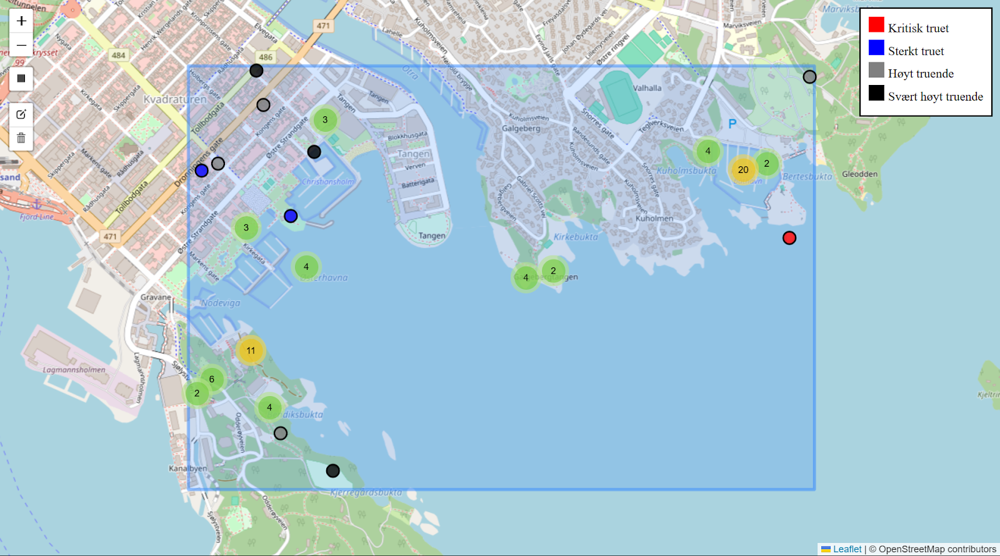
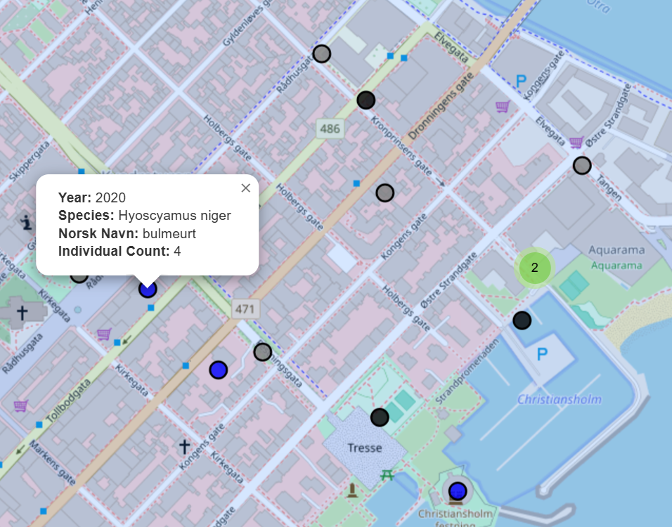
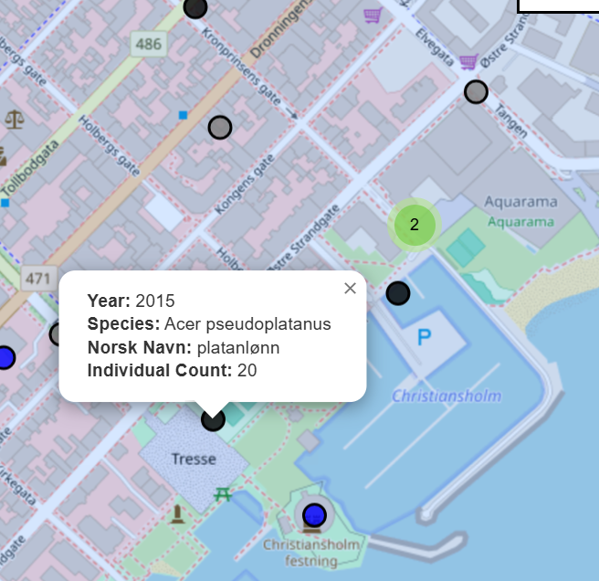

# IS-218-oppgave-2
Gruppe 14 sin løsning på oppgave 2 i IS-218

Problemstilling: Er det stor sannsynlighet for å se truede arter i studentenes nærområde? Hvilke arter er kritisk og sterkt truet? Hvilke arter kan anses som truende for norsk natur og biomangfold?  Hvilke arter er mest truende for naturen i studentenes nærområder?

Vi har hentet datasett fra Geonorge, som er “ Rødlistearter” og har valgt ut kritisk truet og sterkt truet arter. Videre har vi brukt “Artkart fremmede arter” for å hente ut fremmede arter som kan være truende for norsk natur. Supabase fungerer som databasen som lagrer artsinformasjonen, mens kartvisningen er implementert med Leaflet sammen med utvidelsene markercluster for gruppering av markører og draw for å tegne områder. Filen Artsmangfold.html inneholder den aktuelle løsningen.

Kartet initialiseres med Kristiansand som senterpunkt og setter opp fire ulike markercluster-grupper for forskjellige kategorier av arter basert på fare for utryddelse eller fare for norsk natur. Når brukeren tegner et rektangel på kartet, henter systemet data fra Supabase med serversidefiltrering som begrenser dataene til funn fra 2010 eller senere innenfor det spesifikke geografiske området, og kun henter relevant data fra radene.

Utifra kartet (se Figur 1) kan vi se at sannsynligheten for å se trude arter i Kristiansand sentrum er relativt stor. Arter blir representert i klynger, der man får oversikt over både truede og truende arter i området.

Figur 1: Kart over Kristiansand med et markert område der arter visualiseres som klynger. 
På kartet vises de kritisk truet artene som røde prikker, mens de sterkt truet artene vises som blå prikker (se Figur 2). Videre er de høyt truende artene representert av grå prikker og de svært høyt truende artene vises som sorte prikker (se Figur 3) . For å få mer informasjon om de ulike artene må man klikke inn på prikken og da får man opp året den ble funnet, art, norsk navn og hvor mange som er funnet. 

Figur 2: Eksempel på informasjon som kommer opp ved å trykke på et valgt punkt. De blå prikkene viser sterkt truede arter.

Figur 3: Eksempel på informasjon som kommer opp ved å trykke på et valgt punkt. De svarte prikkene viser svært høyt truende arter for norsk natur.

I Kristiansand sentrum finnes det både arter som utgjør en trussel mot norsk natur og arter som regnes som truede. Antall prikker i figurene indikerer et begrenset biomangfold i studentenes nærområde. Figur 2 viser at studentene har mulighet til å observere truede arter, som bulmeurt, i sitt nærområde. Dataene fra Figur 3 viser at studentene også kan komme i kontakt med truende arter som platanlønn. Det er viktig å merke seg at tallene er basert på eldre data og kan ha endret seg siden innsamlingen.

Hele løsningen er satt sammen med standard webteknologier (HTML, CSS, JavaScript) og fokuserer på effektiv datahåndtering og brukervennlig visualisering, slik at brukere enkelt kan utforske artsmangfoldet i selvvalgte geografiske områder.
